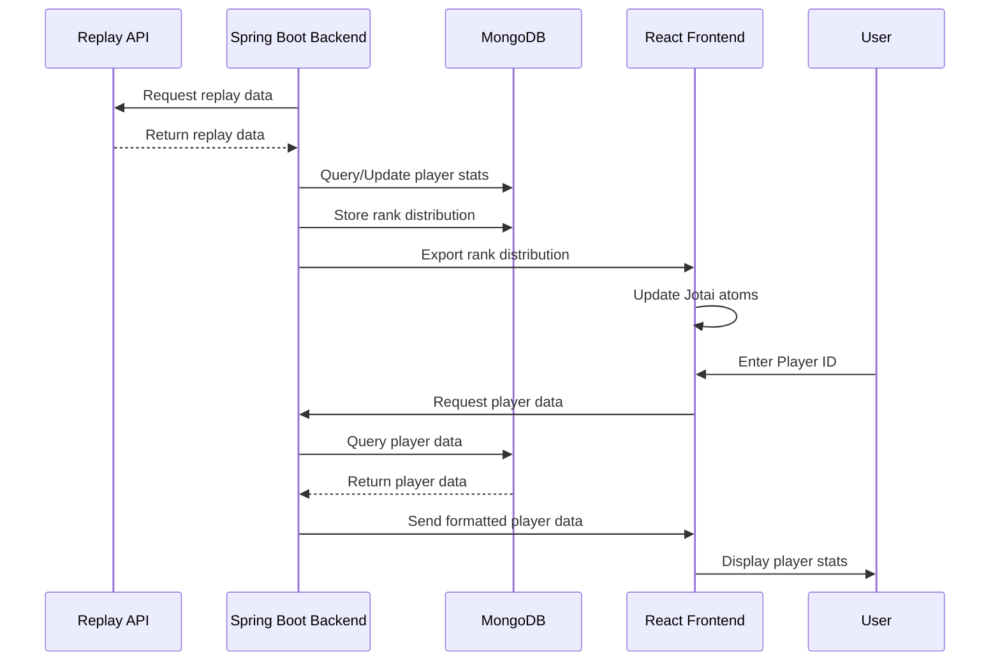

Backend Diagram

```mermaid
sequenceDiagram
    participant API as Replay API
    participant BE as Spring Boot Backend
    participant DB as MongoDB
    participant FE as React Frontend
    participant User

    BE->>API: Request replay data
    API-->>BE: Return replay data
    BE->>DB: Query/Update player stats
    BE->>DB: Store rank distribution
    BE->>FE: Export rank distribution
    FE->>FE: Update Jotai atoms

    User->>FE: Enter Player ID
    FE->>BE: Request player data
    BE->>DB: Query player data
    DB-->>BE: Return player data
    BE->>FE: Send formatted player data
    FE->>User: Display player stats
```