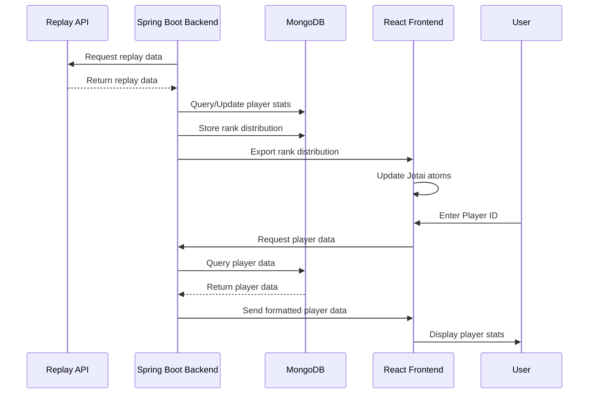
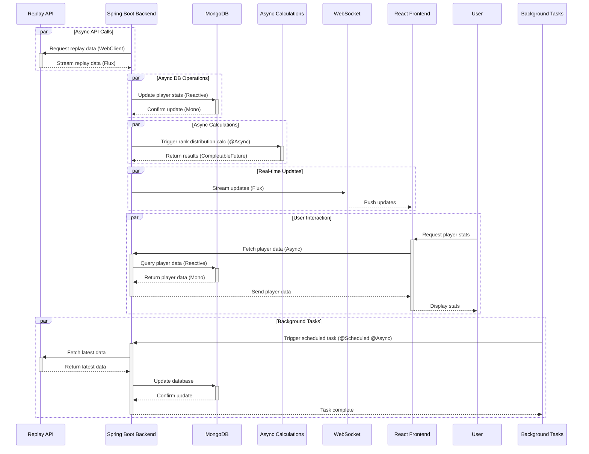
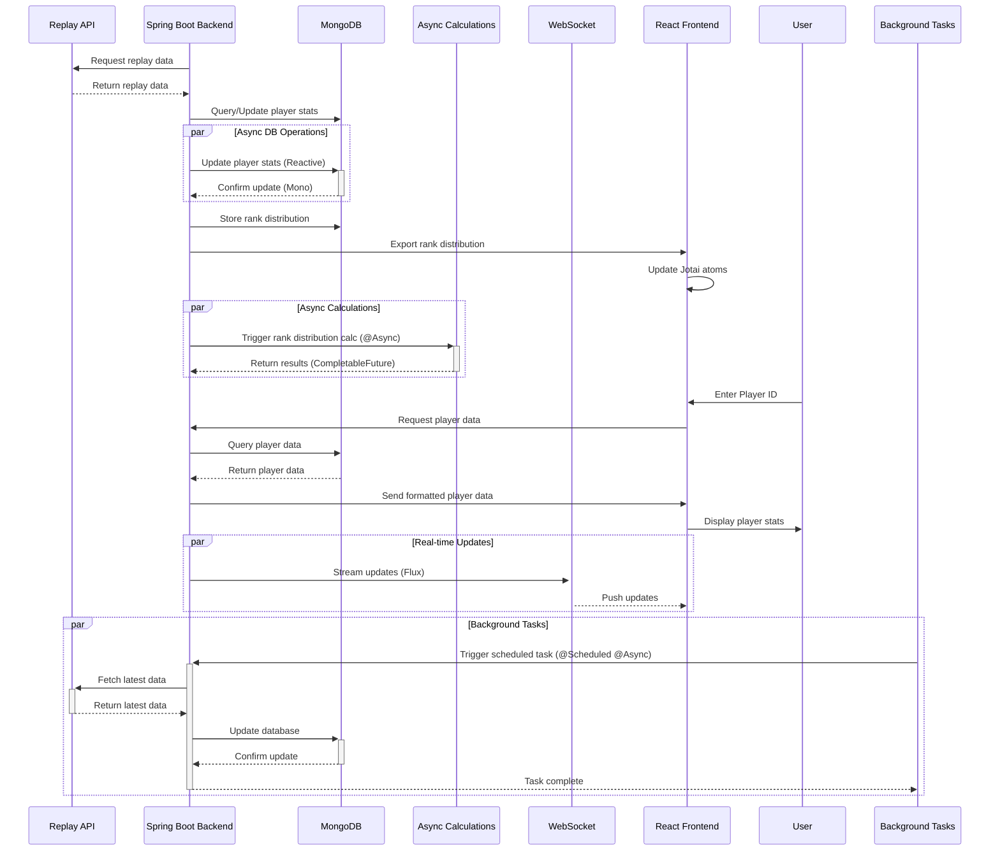

Synchronous Backend

```mermaid
sequenceDiagram
    participant API as Replay API
    participant BE as Spring Boot Backend
    participant DB as MongoDB
    participant FE as React Frontend
    participant User

    BE->>API: Request replay data
    API-->>BE: Return replay data
    BE->>DB: Query/Update player stats
    BE->>DB: Store rank distribution
    BE->>FE: Export rank distribution
    FE->>FE: Update Jotai atoms

    User->>FE: Enter Player ID
    FE->>BE: Request player data
    BE->>DB: Query player data
    DB-->>BE: Return player data
    BE->>FE: Send formatted player data
    FE->>User: Display player stats
```

Aynschronous Backend

```mermaid
sequenceDiagram
participant API as Replay API
participant BE as Spring Boot Backend
participant DB as MongoDB
participant Calc as Async Calculations
participant WS as WebSocket
participant FE as React Frontend
participant User
participant BG as Background Tasks

    par Async API Calls
        BE->>+API: Request replay data (WebClient)
        API-->>-BE: Stream replay data (Flux)
    end

    par Async DB Operations
        BE->>+DB: Update player stats (Reactive)
        DB-->>-BE: Confirm update (Mono)
    end

    par Async Calculations
        BE->>+Calc: Trigger rank distribution calc (@Async)
        Calc-->>-BE: Return results (CompletableFuture)
    end

    par Real-time Updates
        BE->>+WS: Stream updates (Flux)
        WS-->>FE: Push updates
    end

    par User Interaction
        User->>+FE: Request player stats
        FE->>+BE: Fetch player data (Async)
        BE->>+DB: Query player data (Reactive)
        DB-->>-BE: Return player data (Mono)
        BE-->>-FE: Send player data
        FE-->>-User: Display stats
    end

    par Background Tasks
        BG->>+BE: Trigger scheduled task (@Scheduled @Async)
        BE->>+API: Fetch latest data
        API-->>-BE: Return latest data
        BE->>+DB: Update database
        DB-->>-BE: Confirm update
        BE-->>-BG: Task complete
    end
```

Hybrid Approach

```mermaid
sequenceDiagram
    participant API as Replay API
    participant BE as Spring Boot Backend
    participant DB as MongoDB
    participant Calc as Async Calculations
    participant WS as WebSocket
    participant FE as React Frontend
    participant User
    participant BG as Background Tasks

    %% Step 1: Start with Synchronous API Calls
    BE->>API: Request replay data
    API-->>BE: Return replay data
    BE->>DB: Query/Update player stats

    %% Step 2: Introduce Asynchronous DB Operations
    par Async DB Operations
        BE->>+DB: Update player stats (Reactive)
        DB-->>-BE: Confirm update (Mono)
    end

    %% Step 3: Synchronous Rank Distribution Calculation
    BE->>DB: Store rank distribution
    BE->>FE: Export rank distribution
    FE->>FE: Update Jotai atoms

    %% Step 4: Introduce Asynchronous Rank Calculation
    par Async Calculations
        BE->>+Calc: Trigger rank distribution calc (@Async)
        Calc-->>-BE: Return results (CompletableFuture)
    end

    %% Step 5: Synchronous Player Data Fetch
    User->>FE: Enter Player ID
    FE->>BE: Request player data
    BE->>DB: Query player data
    DB-->>BE: Return player data
    BE->>FE: Send formatted player data
    FE->>User: Display player stats

    %% Step 6: Introduce Real-time Updates
    par Real-time Updates
        BE->>+WS: Stream updates (Flux)
        WS-->>FE: Push updates
    end

    %% Step 7: Add Background Tasks for Continuous Data Fetching
    par Background Tasks
        BG->>+BE: Trigger scheduled task (@Scheduled @Async)
        BE->>+API: Fetch latest data
        API-->>-BE: Return latest data
        BE->>+DB: Update database
        DB-->>-BE: Confirm update
        BE-->>-BG: Task complete
    end
```
